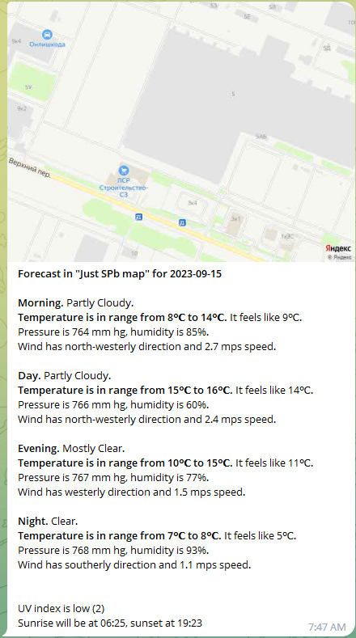
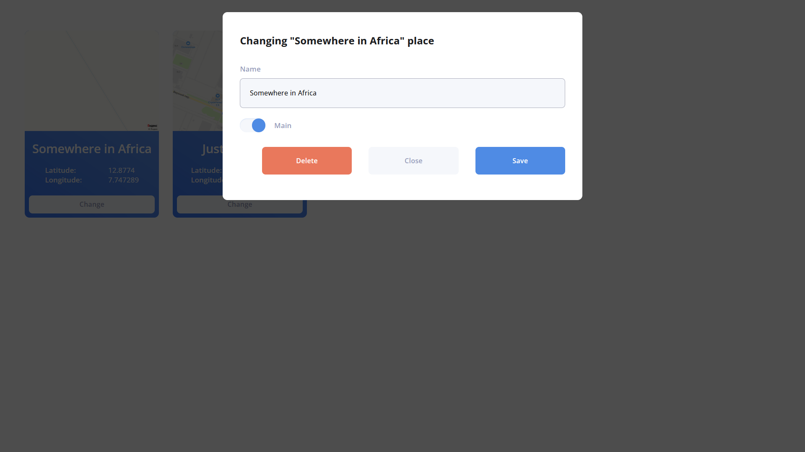
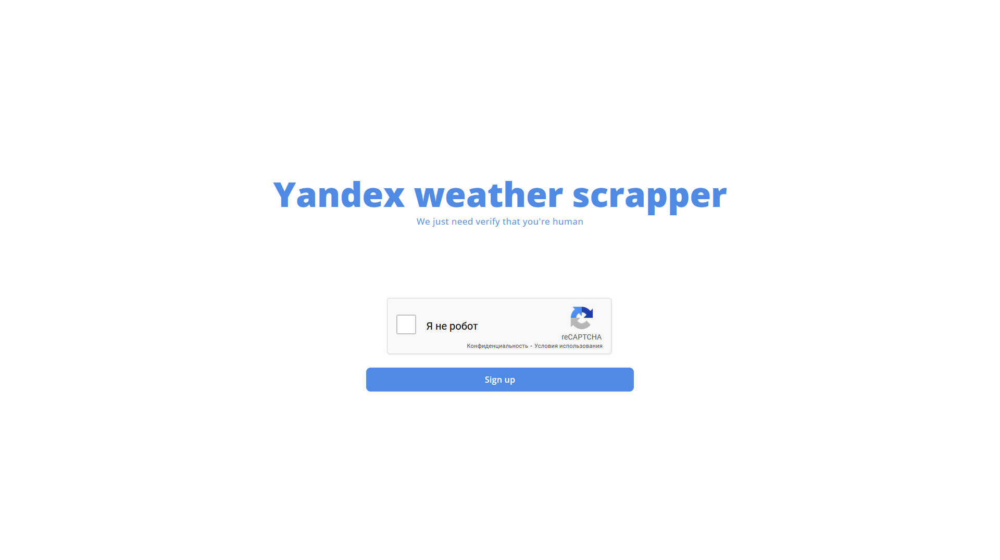

# Yandex Weather telegram bot
Bot that gets forecast in any place

## Technologies
- ASP.NET core web API
- pyTelegramBotAPI
- react.js
- Postgresql
- [Yandex static maps API](https://yandex.com/dev/maps/staticapi/)
- Selenium
- Google reCAPTCHA

## How does it works?
1. Bot sends request to server
2. Server scraps [Yandex weather](https://yandex.com/weather/) page
3. JSON serialization
4. Server sends result to bot
5. Bot sends message with forecast to user

### Also available:
- Simple site that written on *React.js*
- Database that store data about user and his places. Database is running on *Postgresql*

## About server
Server is written on *C# ASP.NET core web API*

### API provides you:
#### Actions with user
- Getting user, his places
- User registrating
- User deleting
#### Actions with places
- Getting user's places
- **Getting forecast for place**
- Creating place
- Changing place
- Deleting place
#### Other
- reCAPTCHA verifing on registration

Also, on creating or changing place *server will get map image for this place using Yandex static maps API*

## About telegram bot 
### Bot can:
- Registrate user
- Create place
- Distribute forecasts in places, marked main to user

*You can get commands list sended /help*

### The example of forecast message:


## About site
### Project has simple site that allows user to:
- List his places

- Change or delete place

- Registrate user with *reCAPTCHA*


## Set up the project
### Start the server
1. Create an .env file in WeatherAPI/WeatherAPI
2. Fill .env
```
POSTGRESQL_PASSWORD=
POSTGRESQL_USER=
POSTGRESQL_ENDPOINT=
YANDEX_API_KEY=
RECAPTCHA_SECRET_KEY=
```
3. Run the server
```
cd WeatherAPI/WeatherAPI
dotnet run --urls "https://localhost:7137"
```

### Start the site
1. Install npm
```
cd Client
npm i
```
2. Create an .env file in Client
3. Fill .env
```
VITE_RECAPTCHA_SITE_KEY=
VITE_RECAPTHA_SECRET_KEY=
VITE_TELEGRAM_BOT_URL=
```
4. Run the site
```
cd Client
npm run dev
```

### Start the bot
1. Install python
```
cd bot
py -m venv venv
pip install -r requirements.txt
```
2. Create an .env file in Bot
3. Fill .env
```
TG_BOT_KEY=
TG_BOT_HOST_WITH_PROTOCOL=
FRONTEND_HOST=
```
4. Run the bot
```
py -m app
```

That's all! Thank you, I hope you will enjoy the project 😊